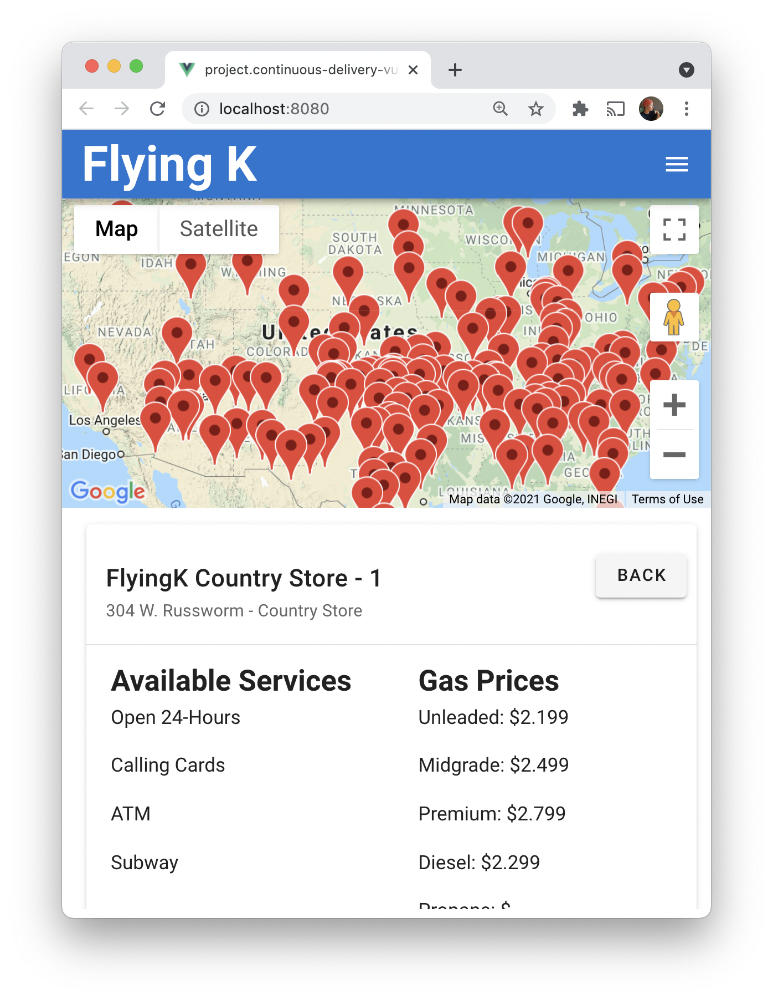

<h1 align="center">FlyingK</h1>



## About

Created during a team project at Code Chrysalis by following contributors:

- [Seth](https://github.com/sethwright)
- [Nick](https://github.com/ntaylor6422)
- [Mai](https://github.com/maiasaumi)
- [Fred](https://github.com/oFrederic)

## Project Goals

FlyingK is a concept 'minimum viable product' app demonstrating integration of our desired tech stack and build with CI, CD principles.

Frontend is a mobile-friendly, responsive design built in Vue, Vuex, Veutify, and implimenting Google Maps JS API.
Backend is a Node.JS + Express server that runs data migrations via Knex to a Postgres DB.

Developed in short sprints: code, merge, deploy to staging server.

## App Concept

Want to know where is the nearest FlyingK, load this app.
At first the App will be loaded with all the shop marked.
You can now filtering using the nav bar :

- Location
- Services
- Amenities
- Store Type
- Restaurants

## Want to give it a try?

1. First clone the repository to your local machine
```
git clone https://github.com/sethwright/flyingk.git
```

2. Install all dependencies
```
npm install
```

3. This app requires developer keys from Google Maps API, please refer to the [official documentation](https://developers.google.com/maps/documentation/javascript/cloud-setup) for more info.

4. Once you have your keys, it can be placed in src/main.js where indicated.

5. Install Postgress and create a database called 'truckstop'

6. Run

```
npm run hack
```

Open the localhost and enjoy the drive 😎